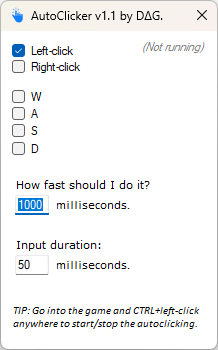

## AutoClicker

  

Opprinnelig laget for Markus som ville jukse litt i Roblox.  
1. Start program.
2. Utfør innstillinger. 
3. Trykk CTRL + Venstre museklikk i program eller spill for å slå den på/av.  

**Endringslogg**
```
V1.1 12.sept.23
+ Lagt til mulighet for å syntetisere WASD som et alternativ til bare museklikk.
+ Lagt til Input duration slik at input får en varighet, f.eks. GTA V trengte dette.
Benytter KEYEVENTF_SCANCODE for bedre simulering av fysisk tastetrykk, testet i GTA V.
Testet OK å gå AFK i GTA Online rett foran safe 💪 både via taster og klikking.
```